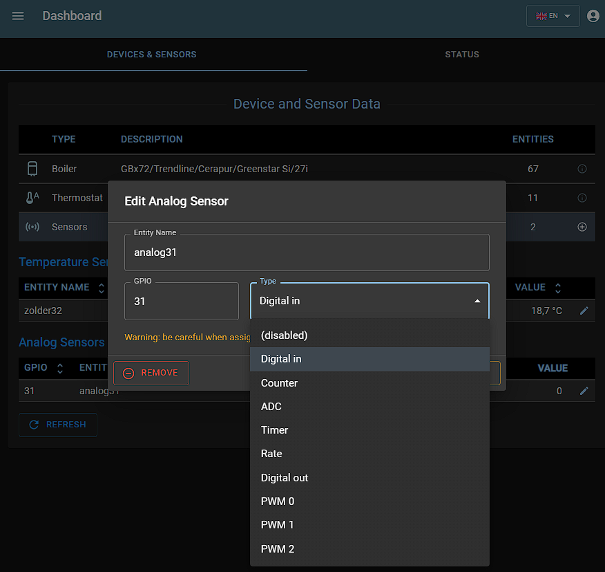
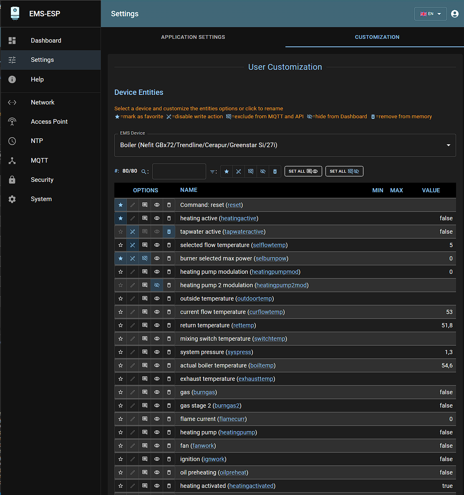

## What the onboard LED is showing you

!!! info

    During the power-on sequence you'll see a sequence of LED flashes:

    * 1 flash means the EMS bus is not connected

    * 2 flashes means the network (wifi or ethernet) is not connected

    * 3 flashes means both EMS bus and network are failing. This is a critical error!

    During normal operation the LED displays the current status:

    * A steady solid light indicates a good connection and EMS data is flowing in

    * A slow pulse can mean either the WiFi or the EMS bus are not connected yet

    * A very fast pulse is when the system is booting up and configuring itself which can typically takes a few seconds

## First-time Configuration

- First connect to the Access Point called `ems-esp` using the default WPA password `ems-esp-neo`.
- When you see the captive portal sign-in with username `admin` and password `admin`.
- Set the WiFi credentials and go back to <http://ems-esp>. Remember to change the password!
- Now check is if Tx is working and that you have a connection to the EMS bus. If Tx failures are shown in the Web interface try changing the Tx Mode from the settings page. There is no need to re-start the EMS-ESP.
- Use the WebUI (<http://ems-esp> or <http://ems-esp.local>) to further configure the settings.

!!! note "If Rx incomplete telegrams are reported in the log, don't panic. Some telegrams can be missed and this is usually caused by noise interference on the line."

## EMS-ESP Settings

In the `Settings` page in the WebUI you'll find:

### Board Profile

- If you have your own ESP32 development board you can choose from a pre-configured board (If you purchased a BBQKees Gateway this is already preselected) or select `Custom` to see and change the hardware settings:
  - **Rx GPIO** - Which GPIO pin the Rx is assigned to. By default this is GPIO 23 but it can be almost any free pin. Connect this GPIO pin to the RX port on the EMS interface board.
  - **Tx GPIO** - Which GPIO pin the Tx is assigned to. By default this is GPIO 5 but it can be almost any free pin. Connect this GPIO pin to the TX port on the EMS interface board.
  - **Button GPIO**. Set a pin with pull-up. The button is used for different functions, such as holding for 10 seconds to reset to factory settings.
  - **Temperature GPIO**. This is the pin where any external temperature sensors are attached. The Dallas chips DS1822, DS18S20, DS18B20, DS1825 are supported including their parasite varieties and can also be daisy-chained onto a single line, up to 100 sensors.
  - **LED GPIO**. This is the pin for the LED, defaulted to the onboard LED on the ESP dev board.
  - And a set of Ethernet settings for the advanced tweakers.

!!! note "On ESP32 development boards there are often also pins marked RX and TX. However, these are usually connected to the USB chip and cannot be used for the EMS interface circuit"

### EMS Bus

- **Tx Mode**. Tx Mode is the mode in which EMS-ESP sends telegrams on the EMS bus. Choose the mode that works best for your system and watch for Tx errors in the Web Dashboard and `show ems` in the Console. Changing the value has immediate effect.
  - `EMS` is the default for EMS1.0 systems but also compatible with most other bus protocols.
  - `EMS+` is designed to work better for EMS2.0/EMS+ systems.
  - `HT3` for Heatronics3 used primarily by Junkers.
  - `Hardware` uses the internal ESP's hardware to send out the telegram. Telegrams are sent immediately. It is the fastest and most efficient method but works only on some systems.
- **Bus ID**. The EMS-ESP can simulate multiple devices. Stick to the `Service Key (0x0B)` unless using more than one EMS gateways/interface board.

### General Options

- **Hide LED**. Turns off the LED when in normal operating mode. The LED is still shown when booting or when there are connection issues.
- **Enable Telnet Console**. This is on by default and allows users to connect to the in-secure Telnet server on port 23.
- **Enable Analog Sensors**. This enables any GPIO to collect signals, whether it's a digital I/O, a pulse counter or ADC measuring mv.
- **Convert temperature values to Fahrenheit**. For our US friends.
- **Bypass Access Token authorization on API calls**. For RESTful write commands via HTTP POST the access token is required. This is for security reasons to prevent anyone changing device settings. Setting this flag makes the API open. Not recommended!
- **Enable Read only mode**. This disables any outgoing Tx write commands to the EMS bus, essentially putting EMS-ESP into listening mode.
- **Underclock CPU speed**. Under-clocks the ESP to 160Mhz, saving on power, heat and prolonging the lifespan of the chip at the cost of performance and response time. A reboot of EMS-ESP is required.
- **Enable Shower Timer**. Enable to time how long the hot water runs for and it will send out an MQTT message with the duration. The timer starts after a minimal of 2 minutes running time.
- **Enable Shower Alert**. This is experimental and may not work on all systems. After 7 minutes running hot water, send out a warning by 3 short bursts of cold water. The boiler goes into test mode to perform this operation so use with caution.

### Formatting Options

- **Boolean Format Dashboard**. This is how boolean values are displayed in the WebUI and MQTT payloads.
- **Boolean Format API/MQTT**. This is how boolean values are written in the MQTT payloads and API JSON output.
- **Enum Format API/MQTT**. This is how list values are presented in the MQTT payloads and API JSON, either by it's value or the index position within the list.

### Temperature Sensors

- **Enable parasite power**. Select this option when using (Dallas) temperature sensors with parasitic power.

### Logging

- **Log EMS telegrams in hexadecimal** will write the telegrams in raw format as hexadecimal values everywhere.
- **Enable Syslog**:
  <!-- prettier-ignore -->
    - **IP** is the IP address of a syslog server for capturing remote logs. Leave blank is not using SysLog.
    - **Port** if using an alternate port number. The default is 514. And it uses UDP (not TCP).
    - **Log Level** sets the maximum log level for reported messages. The highest level is DEBUG which will send a lot of log data so use with caution.
    - **Mark Interval** will send out a special `mark` message to the SysLog. This is useful for timing events.

## MQTT Settings

These settings can be found in the `MQTT` tab on the WebUI. Most are self-explanatory and the settings that are specific to EMS-ESP are:

- **Broker Address**. Use the IP address.
- **Client ID**. This is used internally to identify EMS-ESP with the broker and is optional. Note MQTT topics will be postfixed with the hostname (default `ems-esp`) and not the client ID.
- **Base**. All topics are prefixed with `Base`, which is defaulted to `ems-esp` and can be changed to an individual path.
- **Set Clean Session**. Creates a non-persistent session when enabled. Default is disabled.
- **QoS**. Quality of Service, 0, 1 or 2. 0 is the default and suitable for more scenarios. 1 will give a guarantee that the message has been sent, but will create slightly more traffic and overhead.
- **Always use Retain Flag**. Enable if you want to persist all the messages on the broker. Default is off.
- **Formatting**. The `As individual topics` option will send all data as separate topics, and `Nested` will group the data into one single JSON payload. The default is nested.
- **Publish command output to a 'response' topic'**. This takes the output from an API command (e.g. read) and publishes the result in a topic called `response`.
- **Publish single value topics on change**. This option will immediately publish the topic and payload for each operation and only available when MQTT Discovery is disabled.
- **Enable MQTT Discovery**. Enables the integration with Home Assistant and Domoticz.
  <!-- - prettier-ignore -->
      - **Entity ID format**: There are 3 options. The first `single instance, long names` uses the older < v3.5 format. The default and recommended setting for all new installs is the 2nd option called `Single instance, short name` which uses the EMS-ESP device entity name, which is fixed and can be seen in the `Settings->Customization` page. The last option is targeted for multiple instances of EMS-ESP running and prefixes all MQTT topics with the base name (which must be unique to work).
- **Publish Intervals**. This section is per device and sets how frequent an MQTT message is sent. When set to 0 EMS-ESP will send data automatically when there is a noticeable change, which could be within a few seconds.

## Adding external sensors

External sensors, like temperature and analog sensors can be attached to a range of GPIO pins on the ESP32 chip. If using a BBQKees Gateway board it already has an external plug for Dallas temperature sensors which will be visible in the WebUI without any configuration.

To add custom sensors click on the `+` next to `Sensors` from the Dashboard and choose between a normal Digital in/out, a Counter (counting on/off pulses), ADC for measuring voltages, Timer, Rate and PWM 0-2.

!!! warning

    Be careful when picking a GPIO so it doesn't clash with the other used GPIOs (you can select CUSTOM board profile to view your current configuration).

    EMS-ESP is connected to the low voltage bus of your heating and over-voltage can damage ems-esp and your heating. Do not power external equipment from the EMS-ESP board.

    ESP32 development boards vary in their available pin configuration. Typically you can't use 1, 6-11, 12, 14, 15, 20, 24, 28-31 and 40+. See these links [here](https://diyprojects.io/esp32-how-to-use-gpio-digital-io-arduino-code/#.YFpVEq9KhjG) and [here](https://nodemcu.readthedocs.io/en/dev-esp32/modules/gpio/).

The following GPIOs are recommended:

- digital output: 13, 19, 21, 22, 27, 33, 37, 38
- digital input/counter/timer/rate: 13, 19, 21, 22, 25, 26, 27, 33, 35, 37, 38, 39 (note no pullup on 35 & 39)
- ADC input: 13, 19, 21, 22, 25, 26, 27, 33, 35, 37, 38, 39
- DAC output: 25, 26
- PWM output: 13, 19, 21, 22, 25, 26, 27, 33, 37, 38

Limits:

- ADC: 1.5V
- DAC 8bit
- PWM: max. frequency 5000Hz, resolution 13bits
- Counter/timer/rate trigger on high->low edge with 15 ms debounce. Only for low pulse rates.

## Customization

This page shows all registered entities and allows to exclude commands and values from publishing via mqtt/api or remove them from dashboard. The dashboard only shows entities with values, the customization page shows all. If an entity has no value then it is supported by EMS-ESP, but not by your boiler/thermostat/etc.

