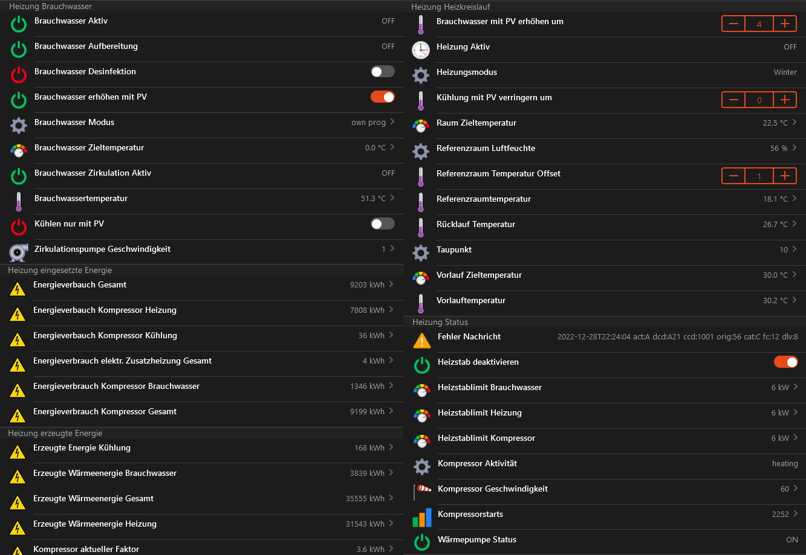
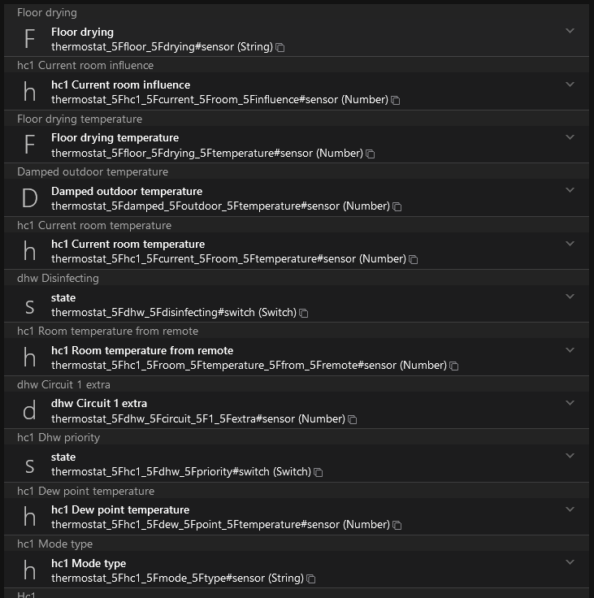
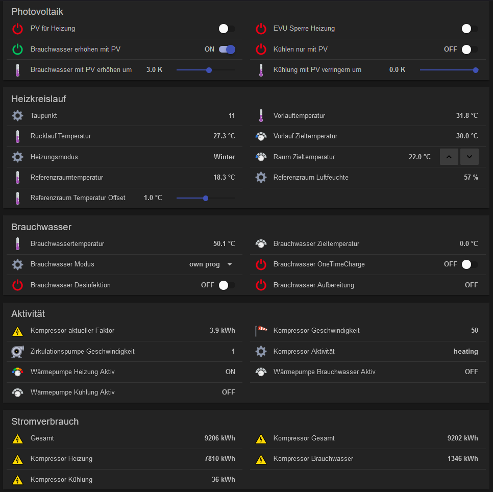

EMS-ESP can be integrated into openHab through different ways:

- HomeAssistant MQTT Components Binding (based on Home Assistent discovery protocol)
- MQTT Binding (Generic MQTT Thing)

<figure markdown>
  
  <figcaption>Example Dashboard (items depend on heating system)
</figcaption>
</figure>

!!! note "It depends on the entity and the device if it is writable or just readable. Have a look into the list of entities [**Entities**](All-Devices) for all available entities and related attributes."

!!! note "Documentation has been created for openHab version 3.x"

## HomeAssistant MQTT Components Binding
### Installation
EMS-ESP creates retained MQTT messages prefixed with `homeassistant/` for each device and their values (called entities) based on the Home Assistant (HA) Discovery protocol. To allow auto discovery in openHAB the [MQTT Binding](https://www.openhab.org/addons/bindings/mqtt/) and the [HomeAssistant MQTT Components Binding](https://www.openhab.org/addons/bindings/mqtt.homeassistant/) has to be installed. Additionally `JINJA` and `JSONPath` transformations are needed to map all entities and features. In EMS-ESP enable the Discovery option from the MQTT Settings page.

Objects in HA are mapped to `Things`, Component+Node to `ChannelGroup` and Component Features to `Channels`. More information can be found in the binding specification.

### Discovery
You should see based on your heating setup related `Things` in your Inbox
<figure markdown>
  
  <figcaption>Inbox with EMS-ESP discovered Things
</figcaption>
</figure>

After adding the `Things` you can see all `Channels` that are available for the specific device and which you have enabled in EMS-ESP for MQTT.
<figure markdown>
  
  <figcaption>Channels of a thermostat Thing
</figcaption>
</figure>

### Limitations
There are currently some limitations by using the binding. One of them is also affecting the integration of EMS-ESP into openHAB.

- The HomeAssistant Climate Components is not yet supported (you won´t find those `Channels` in the list)

It is possible that those entities will be supported in future depending on the further development of the binding.

## MQTT Binding
EMS-ESP offers all information via the base [**MQTT**](Commands#mqtt) path `ems-esp/` using topics and payloads that can be mapped to `Generic MQTT Things` and related `Channels`.

openHAB offers different kind of configuration models to add new devices

- File based
- UI driven (can be combined)
    * yaml based (Code Editor)
    * UI Guided Menus

### Installation
You need to install the [MQTT Binding](https://www.openhab.org/addons/bindings/mqtt/) as client for a MQTT broker and the [JSONPath Transformation Service](https://www.openhab.org/addons/transformations/jsonpath/) for selecting the specific channels in the provided JSON-structure of EMS-ESP.

### File based approach
#### Generic MQTT Thing
It is possible to create for each device a seperate `Generic MQTT Thing` or all in just one. In the following an example will be provided that can be adapted to your corresponding setup and you wishes. It is a common approach to have a seperate set topic that is used to send data back to the broker. stateTopic represents the state of the thing and commandTopic is been used to set a value. You can find all relevant information regarding the topic you need to send a command to in the [**Commands**](Commands#mqtt).

```python title="things/mqtt.things"
Bridge mqtt:broker:broker "MQTT Bridge" [ host="127.0.0.1", secure=false ]{
    Thing topic ems-esp "Buderus Heating Pump" @ "gBoilerRoom" [availabilityTopic="ems-esp/status", payloadAvailable="online", payloadNotAvailable="offline"]{
    Channels:
       Type switch : EMS_s_pvcooling "Cooling only with PV" [stateTopic="ems-esp/boiler_data", commandTopic="ems-esp/boiler/pvcooling", ON="ON", OFF="OFF", transformationPattern="JSONPATH:$.pvcooling"]
       Type number : EMS_n_pvraiseheat "Raise Hot Water with PV by" [stateTopic="ems-esp/thermostat_data", commandTopic="ems-esp/thermostat/pvraiseheat", transformationPattern="JSONPATH:$.pvraiseheat"]
       Type string : EMS_maxheatheat "Auxilliary Heater Limit Heating" [stateTopic="ems-esp/boiler_data", commandTopic="ems-esp/boiler/maxheatheat", transformationPattern="JSONPATH:$.maxheatheat"]
    }
}
```

#### Items
It does make sense to use the `autoupdate` feature. Instead of using the expected value from changing the item openHAB is waiting for an update from EMS-ESP via MQTT.

```python title="items/ems-esp.items"
Switch           EMS_s_pvcooling
                 "Cooling only with PV"
                 <switch>
                 (gBoilerRoomHeatingHotWater)
                 ["Switch", "Water"]
                 {channel="mqtt:topic:broker:ems-esp:EMS_s_pvcooling", autoupdate="false"}

Number           EMS_n_pvraiseheat
                 "Raise Hot Water with PV by [%.1f K]"
                 <temperature>
                 (gBoilerRoomHeatingCircuit)
                 ["Setpoint","Temperature"]
                 {channel="mqtt:topic:broker:ems-esp:EMS_n_pvraiseheat", autoupdate="false", listWidget="oh-stepper-item"[min=0, max=5, step=1]}

String           EMS_maxheatheat
                 "Auxilliary Heater Limit Heating"
                 <heating>
                 (gBoilerRoomHeating)
                 ["Control", "Current"]
                 {channel="mqtt:topic:broker:ems-esp:EMS_maxheatheat", autoupdate="false", stateDescription=""[options="0=0 KW,1=2 kW,2=3 kW,3=4 kW,4=6 kW,5=9 kW"]}
```
#### Sitemap (optional)
```python title="sitemaps/home.sitemap"
Frame label="Heating" {
    Switch item=EMS_s_pvcooling
    Slider item=EMS_n_pvraiseheat
    Selection item=EMS_maxheatheat
}
```
<figure markdown>
  
  <figcaption>Example Sitemap (items depend on heating system)
</figcaption>
</figure>

### UI based approach
It is also possible to use the UI of openHab and the integrated Code-Editor to implement the integration of EMS-ESP. Therefor several steps have to be done in sequence.

1. Create a MQTT Broker by (Things -> (+) Icon -> MQTT Binding -> MQTT Broker)
2. Edit the created MQTT Broker and paste the code below. Change attributes where needed or change them in the UI. (Things -> -Your Created MQTT Broker- -> Code-Tab)

#### MQTT Broker & MQTT Generic Thing
```yaml title="MQTT Broker"
UID: mqtt:broker:broker
label: MQTT Bridge
thingTypeUID: mqtt:broker
configuration:
  lwtQos: 0
  publickeypin: true
  keepAlive: 60
  clientid: d825330e-3c51-4818-a43d-62778d379c83
  qos: 0
  reconnectTime: 60000
  host: 127.0.0.1
  secure: false
  certificatepin: true
  lwtRetain: true
  enableDiscovery: true
```

3. Create a `Generic MQTT Thing` (Things -> (+) Icon -> MQTT Binding -> Generic MQTT Thing)
4. Edit the created `Generic MQTT Thing` and paste the code below. Change attributes where needed or change them in the UI. (Things -> -Your Created Generic MQTT Thing- -> Code-Tab)

```yaml title="Generic MQTT Thing"
UID: mqtt:topic:broker:ems-esp
label: Buderus Heating Pump
thingTypeUID: mqtt:topic
configuration:
  payloadNotAvailable: offline
  availabilityTopic: ems-esp/status
  payloadAvailable: online
bridgeUID: mqtt:broker:broker
location: gBoilerRoom
channels:
  - id: EMS_s_pvcooling
    channelTypeUID: mqtt:switch
    label: Cooling only with PV
    description: null
    configuration:
      retained: false
      postCommand: false
      formatBeforePublish: "%s"
      commandTopic: ems-esp/boiler/pvcooling
      stateTopic: ems-esp/boiler_data
      transformationPattern: JSONPATH:$.pvcooling
      off: off
      on: on
  - id: EMS_n_pvraiseheat
    channelTypeUID: mqtt:number
    label: Raise Hot Water with PV by
    description: null
    configuration:
      retained: false
      postCommand: false
      formatBeforePublish: "%s"
      commandTopic: ems-esp/thermostat/pvraiseheat
      step: 1
      stateTopic: ems-esp/thermostat_data
      transformationPattern: JSONPATH:$.pvraiseheat
  - id: EMS_maxheatheat
    channelTypeUID: mqtt:string
    label: Auxilliary Heater Limit Heating
    description: null
    configuration:
      commandTopic: ems-esp/boiler/maxheatheat
      retained: false
      postCommand: false
      formatBeforePublish: "%s"
      stateTopic: ems-esp/boiler_data
      transformationPattern: JSONPATH:$.maxheatheat
```
#### Items
Select in the Things overview your created `Thing` and select `Channels`. In list of channels you can click on Use the `Add Link to Item` and create an item.

## Errors
- It can happen that mqtt sends always the current state as value instead of the new one. A possible solution could be restarting openHab service and check if you have an item dimension. If there is one remove the dimension.
- There is currently no way to show the status of the `Thing` without using a rule
