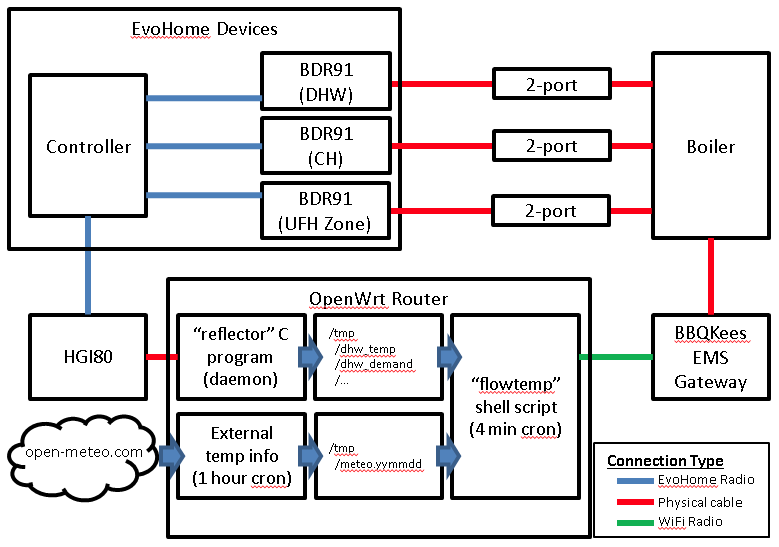

**Below are a collection of useful tips, tricks and code submitted by the community:**

## Control the boiler heating

_(by @Oderik)_

In a very simple setup a boiler provides heat to one heating circuit. If `heating activated` is `on`, the boiler maintains the `selected flow temperature` by regulating the burner and the heat pump.

Once the `current flow temperature` exceeds the `selected flow temperature` + `temperature hysteresis off`, the heating will stop until the `current flow temperature` drops below the `selected flow temperature` + `temperature hysteresis on` (which is typically a negative value).

Thus to activate the heating you will need to set `heatingactivated` to `on` and set an appropriate `flowtemp`. The latter should be derived from the `heating temperature setting` which can be set using the physical dial/control on the boiler. It should be considered as the maximum flow temperature. You can also use a lower flow temperature to maintain a constant room temperature once the initial heating is done.

## Retrieve data via REST using PHP

_(by @flohse123)_

```php
<?php
$ch = curl_init("http://<myIP>/api?device=thermostat&cmd=info");
curl_exec($ch);
curl_close($ch);
?>
```

## Adjusting the flow temperature based on whether CH or DHW is being heated

_(by @IanC)_

<!-- prettier-ignore -->
!!! quote "From the Discord post IanC said:"
    "With a ~2012 Worcester Bosch boiler, house heating is managed by an EvoHome system that knows which parts of house need how much heat, but it can only use an on/off relay to control the boiler for space and water heating. This means it cannot directly control flow temperature, and historically this has been set at continuous 65C via dial on front of boiler to allow water heating when needed. Very pleased to have added EMS-ESP to my system to help manage flow temperatures. I wrote a simple C program to run on my OpenWrt internet router which eavesdrops on EvoHome messages to capture useful information on what amount of heat is needed for space and water into simple txt files in /tmp. I then schedule a shell script every 4 minutes which uses a few steps to select a flow temperature: start with a weather compensated value based on exterior temperature from online service; adjust this up or down by up to 25% based on EvoHome space heat demand; if necessary override this to heat hot water. The selected flow temperature and a max burner level are then sent via curl to a @BBQKees device running EMS-ESP which in turn controls boiler. So far it seems to be working as intended without loss of house comfort but with much lower flow temperatures observed to try and encourage boiler operating in condensing zone.  Very hard to tell if it is affecting gas consumption - which I would like it to :). Main challenge I still see is how to stop EvoHome causing frequent on/off cycles of boiler while it still tries to use TPI flow control management."



The temperature compensation algorithms are in the shell script:

```sh title="set_flowtemp.sh"
#!/bin/sh -x
MINFLOW=30.0
MAXFLOW=70.0

function set_flowtemp() {
local boiler_key=$(cat /tmp/boiler-key.txt)
curl --silent http://192.168.0.140/api/boiler/selflowtemp \
  -H "Content-Type: application/json" -d "{ "value" : $1 }" \
  -H "Authorization: Bearer $boiler_key"

local burner_power=$(echo $1 | awk '{ \
if ($1 < 40.0) bp = 35;\
else if ($1 < 50.0) bp = 50;\
else if ($1 < 60.0) bp = 65;\
else bp = 90.0; \
printf "%2.1f", bp}')

curl --silent http://192.168.0.140/api/boiler/selburnpow \
  -H "Content-Type: application/json" -d "{ "value" : $burner_power }" \
  -H "Authorization: Bearer $boiler_key"
}

function dhw_active(){
  local active="false"
  if [[ -f /tmp/relay_dhw ]]; then
    active=$(cat /tmp/relay_dhw | awk '{if ($1 == 0.0) print "false"; else print "true";}')
  else
    local curr_hour=$(date +%H)
    if [[ $curr_hour -eq 6 ]] || [[ $curr_hour -eq 16 ]]; then
      active="true"
    fi
  fi

  echo $active
}

function dhw_flowtemp(){
  if [[ -f  /tmp/temp_dhw ]]; then
    echo $(cat /tmp/temp_dhw | awk '{printf "%2.1f", $1 + 20.0}')
  else
    echo $MAXFLOW
  fi
}

function outside_temp(){
  if [[ -f  /tmp/meteo.$(date +%Y%m%d) ]]; then
    echo $(cat /tmp/meteo.$(date +%Y%m%d)|jq .hourly.temperature_2m[$(date +%H)])
  else
    echo UNKNOWN
  fi
}

function weather_flowtemp(){
  local otemp=$(outside_temp)
  if [[ $otemp = "UNKNOWN" ]]; then
    # Default flow temperature if no outside temperature available
    echo 65.0
  else
    # Calculated flow temperature if outside temperature available
    # echo $(echo $otemp | awk '{printf "%2.1f", 70.0 - ($1 + 5) * 1.5}')
    echo $(echo $otemp $MINFLOW $MAXFLOW | awk '{printf "%2.1f", $2 + ($3 - $2) / 25.0 * (20.0 - $1)}')
  fi
}

function load_flowtemp(){
  if [[ -f  /tmp/relay_ch ]]; then
    echo $(cat /tmp/relay_ch | awk '{printf "%2.1f", 20.0 + ($1 * 0.50)}')
  else
    echo $(weather_flowtemp)
  fi
}
function load_factor(){
  if [[ -f  /tmp/relay_ch ]]; then
    local relay_demand=$(cat /tmp/relay_ch)
    echo $(echo $1 $relay_demand $MINFLOW | awk '{printf "%2.1f", $3 + ($1 - $3) * (0.75 + $2 / 200.0)}')
  else
    echo $1
  fi
}

function max(){
  echo $(echo $1 $2 | awk '{if ($2 > $1) printf "%2.1f", $2; else printf "%2.1f", $1;}')
}

function min(){
  echo $(echo $1 $2 | awk '{if ($2 < $1) printf "%2.1f", $2; else printf "%2.1f", $1;}')
}

flowtemp=$(weather_flowtemp)
flowtemp=$(load_factor $flowtemp)
if [ $(dhw_active) = "true" ]; then
  alt_flowtemp=$(dhw_flowtemp)
  flowtemp=$(max $flowtemp $alt_flowtemp)
fi
flowtemp=$(min $flowtemp $MAXFLOW)
set_flowtemp $flowtemp
```
